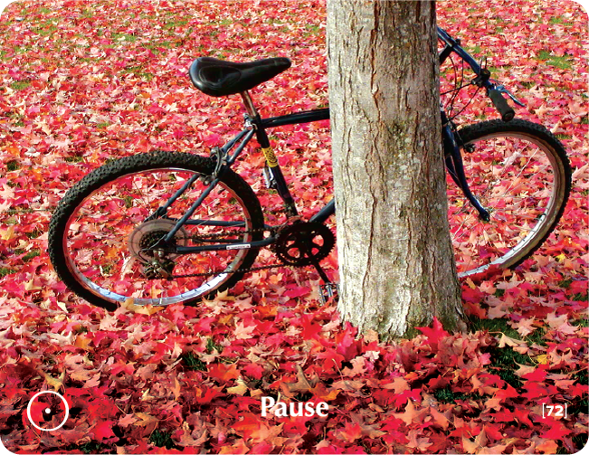

# PAUSE

## Zen Story
A number of students were sitting quietly with their teacher one day when a hunter passed by. The hunter was surprised to see the renowned teacher sitting there at ease and doing nothing at all, remarking that the man's inaction appeared to be a waste of precious time.

"Take your bow, cock it, and fire an arrow," the teacher responded quietly.

And the hunter obliged.

"Cock your bow and fire another arrow," the teacher then said.

And the hunter again obliged -- again and again and again.

Finally the hunter spoke up: "Teacher, if I continue to cock my bow at this rate, it will break."

"The same goes for all of us," said the teacher. "If we push ourselves excessively, we will break too. The right thing to do sometimes is to take a break and cease all activity."

## Key Quotes

> Stop a moment, cease your work, and look around you.
> 
> **Thomas Carlyle**

> Pause is a tool for creating clarity, calmness, a fresh look, and internal peace... there are an infinite number of things you will find out if you only try.
> 
> **Efrat Shani**

> People travel to wonder at the height of mountains, at the huge waves of the sea, at the long courses of rivers, at the vast compass of the ocean, at the circular motion of the stars; and they pass by themselves without wondering.
> 
> **St. Augustine**

> I shut my eyes in order to see.
> 
> **Paul Gauguin**

## Reflection Questions

- **When did life force me to stop?**
- **Why is it so hard to pause? Do I stop enough?**
- **What price am I paying by not stopping even for a moment?**
- **What is my favorite way of stopping and taking a break?**

## Common Responses

### Need for Pause
- I'm overwhelmed. What is meditation? I want to understand. I feel like taking it easy. I need time to think. How am I feeling? I love writing in my diary. What do I want? It has been a long time since I watched the sunset
- I have no time for myself. I'm in a whirlpool. I take myself for a walk. The penny has dropped. I am taking myself out on a date.

## Training Applications

This building block can be used to:
- Help participants recognize the value of taking breaks and pauses
- Address burnout and overwork patterns
- Build mindfulness and present-moment awareness
- Foster self-care and reflection practices
