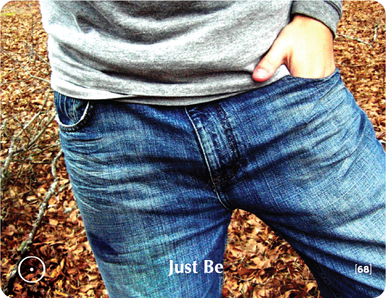

# JUST BE - Building Block Overview

## Overview
The Just Be building block helps participants embrace their authentic selves, addressing overthinking and analysis paralysis while building comfort with stillness and presence.

## Components

### 📖 [Stories & Tales](stories-tales.md)
- Zen story about the centipede and the philosophical frog
- Narrative examples of natural being vs. overthinking

### 💬 [Key Quotes](key-quotes.md)
- Inspirational quotes about authentic being and presence
- Wisdom from various thought leaders

### 🤔 [Reflection Questions](reflection-questions.md)
- Deep questions for personal exploration
- Self-assessment prompts about authentic being

### 💭 [Common Responses](common-responses.md)
- Resistance to being vs. embracing being responses
- Examples of different being mindsets

### 🎯 [Training Applications](training-applications.md)
- Specific ways to use this content in training
- Implementation strategies

## Cross-References

### Related Building Blocks
- **[Should Be](../should-be/README.md)** - Authentic vs. external expectations
- **[Intimacy](../intimacy/README.md)** - Authentic connection with others
- **[Balance](../balance/README.md)** - Holistic well-being
- **[Pause](../pause/README.md)** - Stillness and presence

### Key Concepts
- Authentic self-expression
- Natural being
- Presence and stillness
- Self-acceptance

## Quick Start
1. Begin with the [Zen Story](stories-tales.md) to engage participants
2. Use [Reflection Questions](reflection-questions.md) for personal exploration
3. Address resistance with [Common Responses](common-responses.md)
4. Apply insights through [Training Applications](training-applications.md)
