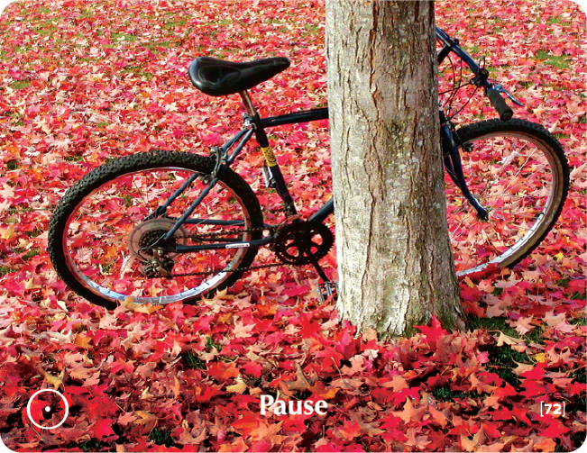

# PAUSE - Building Block Overview

## Overview
The Pause building block helps participants recognize the value of taking breaks and pauses, addressing burnout and overwork patterns while building mindfulness and present-moment awareness.

## Components

### 📖 [Stories & Tales](stories-tales.md)
- Zen story about the teacher and the hunter
- Narrative examples of the value of pause and rest

### 💬 [Key Quotes](key-quotes.md)
- Inspirational quotes about pause and reflection
- Wisdom from various thought leaders

### 🤔 [Reflection Questions](reflection-questions.md)
- Deep questions for personal exploration
- Self-assessment prompts about pause and rest

### 💭 [Common Responses](common-responses.md)
- Need for pause vs. resistance to pause responses
- Examples of different pause mindsets

### 🎯 [Training Applications](training-applications.md)
- Specific ways to use this content in training
- Implementation strategies

## Cross-References

### Related Building Blocks
- **[Just Be](../just-be/README.md)** - Stillness and presence
- **[Balance](../balance/README.md)** - Holistic well-being
- **[Learning](../learning/README.md)** - Taking time to reflect and learn
- **[Solutions](../solutions/README.md)** - Pausing before responding to problems

### Key Concepts
- Rest and renewal
- Mindfulness and awareness
- Self-care and reflection
- Burnout prevention

## Quick Start
1. Begin with the [Zen Story](stories-tales.md) to engage participants
2. Use [Reflection Questions](reflection-questions.md) for personal exploration
3. Address resistance with [Common Responses](common-responses.md)
4. Apply insights through [Training Applications](training-applications.md)
