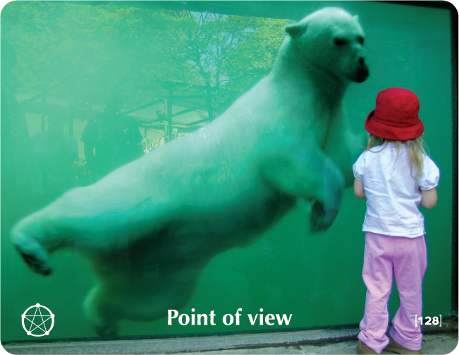

# POINT OF VIEW - Building Block Overview

## Overview
The Point of View building block helps participants understand the relativity of perspectives, addressing conflicts arising from different viewpoints while building empathy and collaborative problem-solving.

## Components

### 📖 [Stories & Tales](stories-tales.md)
- Shoe factory story about two different perspectives on the same situation
- Narrative examples of how perspective shapes reality

### 💬 [Key Quotes](key-quotes.md)
- Inspirational quotes about perspective and truth
- Wisdom from various thought leaders

### 🤔 [Reflection Questions](reflection-questions.md)
- Deep questions for personal exploration
- Self-assessment prompts about perspective and openness

### 💭 [Common Responses](common-responses.md)
- Rigid vs. open point of view responses
- Examples of different perspective mindsets

### 🎯 [Training Applications](training-applications.md)
- Specific ways to use this content in training
- Implementation strategies

## Cross-References

### Related Building Blocks
- **[Learning](../learning/README.md)** - Openness to different perspectives
- **[Solutions](../solutions/README.md)** - Creative problem-solving approaches
- **[Intimacy](../intimacy/README.md)** - Understanding others' perspectives
- **[Balance](../balance/README.md)** - Integrating different viewpoints

### Key Concepts
- Perspective relativity
- Empathy and understanding
- Collaborative problem-solving
- Open communication

## Quick Start
1. Begin with the [Shoe Factory Story](stories-tales.md) to engage participants
2. Use [Reflection Questions](reflection-questions.md) for personal exploration
3. Address resistance with [Common Responses](common-responses.md)
4. Apply insights through [Training Applications](training-applications.md)
