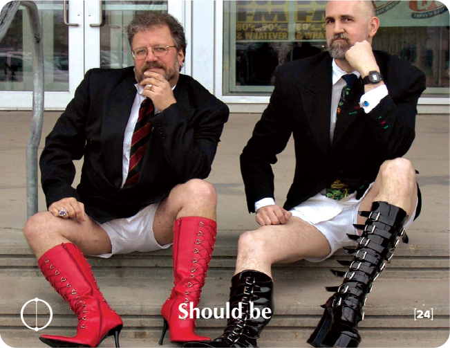

# SHOULD BE - Building Block Overview

## Overview
The Should Be building block examines external expectations vs. personal values, helping participants identify and challenge limiting "should be" beliefs to foster authentic living.

## Components

### 📖 [Stories & Tales](stories-tales.md)
- Personal story about a mother's projection of her own dreams onto her daughter
- Narrative examples of external expectations vs. personal choice

### 💬 [Key Quotes](key-quotes.md)
- Inspirational quotes about authenticity and self-perception
- Wisdom about the impact of external expectations

### 🤔 [Reflection Questions](reflection-questions.md)
- Deep questions for personal exploration
- Self-assessment prompts about external vs. internal expectations

### 💭 [Common Responses](common-responses.md)
- Examples of "should be" beliefs and authentic responses
- Patterns of external expectation vs. personal choice

### 🎯 [Training Applications](training-applications.md)
- Specific ways to use this content in training
- Implementation strategies

## Cross-References

### Related Building Blocks
- **[Choice](../choice/README.md)** - Taking personal responsibility for decisions
- **[Just Be](../just-be/README.md)** - Authentic self-expression
- **[Balance](../balance/README.md)** - Holistic well-being
- **[Intimacy](../intimacy/README.md)** - Authentic connection with others

### Key Concepts
- External expectations
- Authentic self-expression
- Personal values
- Self-acceptance

## Quick Start
1. Begin with the [Personal Story](stories-tales.md) to engage participants
2. Use [Reflection Questions](reflection-questions.md) for personal exploration
3. Address resistance with [Common Responses](common-responses.md)
4. Apply insights through [Training Applications](training-applications.md)
