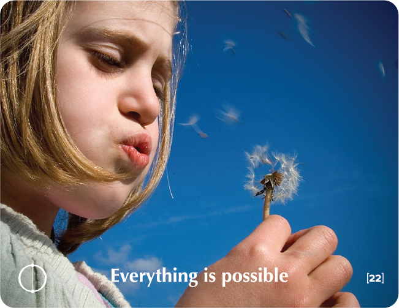

# EVERYTHING IS POSSIBLE

## Walt Disney Story
"Lacking a creative sense" and "no original ideas" Those were the reasons for turning him down, the young artist was told, when he applied for a job as an illustrator at a newspaper. But the young artist was blessed with a sense of confidence unlike those around him.

He believed that creating an entire fantasy world based on illustrated characters creating them in larger than life-size, illuminating it all in the most colorful bright lights, would make people forget their problems, become child-like once again and thus reconnect to their dreams.

The name of the young artist was Walt Disney, who went on to build the incredible Disney Empire.

The early 1900s were undoubtedly not the times to realistically believe in the creation of an entire fantasy world. No one other than Disney himself, believed it would bring such joy to so many children and adults around the world. His optimism changed reality for us all.

Hundreds of millions of people from all around the globe have grown up with the magical world of Walt Disney -- a world that began with the dream of a single individual.

**"If you can dream it, you can achieve it"** would be the creed that guided Disney throughout his enterprise.

## Key Quotes

> To fledgling birds flight in the sky may appear incredible.
> 
> **Rabindranath Tagore**

> The poorest man lacks not a dollar but a dream.
> 
> **Unknown**

> The marble not yet carved can hold the form of every thought the greatest artist has.
> 
> **Michelangelo**

> 'Let go now; you'll never be able to do it!' Ignore that piece of advice and you'll be halfway to your goal.
> 
> **David Tzuker**

## Reflection Questions

- **In a world in which everything's possible: What does my life look like?**
- **With whom am I sharing my life?**
- **Where do I live?**
- **What is keeping me busy?**
- **How much do I earn?**
- **How does my life feel like?**

## Common Responses

### Limiting Beliefs
- Impossible. It's illogical. Who told you so? It won't work. What nonsense!
- I thought just like you when I was young. I don't believe in it. You and your fantasies. No one has ever done it before.

### Possibility Thinking
- Perhaps it is just a dream? I don't know. Dare give it your best shot, it might work out well.

## Training Applications

This building block can be used to:
- Challenge limiting beliefs and expand possibilities
- Encourage participants to dream big and think creatively
- Build confidence in pursuing ambitious goals
- Foster innovation and breakthrough thinking
