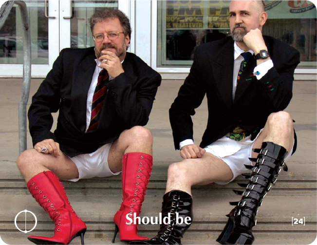

# SHOULD BE

## Personal Story
I have a friend who lives in a very well to do neighborhood. Both she and her husband are successful lawyers; they are two intelligent individuals and each hold prestigious university degrees.

I had been at their home for about an hour or so during a recent visit when my friend told me that she had to leave for a few minutes to pick up her daughter from a dance class. When the two of them returned, the young girl was sobbing and clearly very upset.

I asked my friend what had happened to bring on such crying, and she replied:

"I always wanted to be a dancer and my parents wouldn't hear of it. The same thing is not going to happen to my daughter. She has to be a dancer -- even if it is tough on her. I missed out big time because my parents forced me to become a lawyer. I will never force her to be a lawyer -- she'll be a dancer!"

## Key Quotes

> We don't see things as they are; we see them as we are.
> 
> **Proverb**

> If you were to say to the grown-ups: 'I saw a beautiful house made of rosy brick, with geraniums in the windows and doves on the roof,' they would not be able to get any idea of that house at all. You would have to say to them: 'I saw a house that cost $ 200,000.' Then they would exclaim: 'Oh, what a pretty house that is!'
> 
> **Antoine de Saint-Exupéry, The Little Prince**

> So long as you are yourself, I can get along with you.
> 
> **David D'Angelo**

> The lists of things that "should be" run our lives, without giving an iota of space to who we really are and to the moving surprises that life brings us.
> 
> **Efrat Shani**

## Reflection Questions

- **Who am I "supposed to be"? What "should" my life be like?**
- **Who said that this was the way it "should be"?**
- **How can my "should be" lists be changed?**
- **Where in my life is their clash between what "should be" and what is?**

## Common "Should Be" Examples

- My mother always told me that I should be... good with everyone, so that they would like me. To be a great success. To get all A's in school.
- To be a street-wise businessman, with a sexy wife and an expensive car.
- To be happy.
- To be smart.
- To be beautiful.
- To be a perfect mother, a babe, career-minded, and a good cook.

## Training Applications

This building block can be used to:
- Help participants identify and challenge limiting "should be" beliefs
- Encourage authentic self-expression and personal choice
- Build awareness of external expectations vs. personal values
- Foster self-acceptance and authentic living
