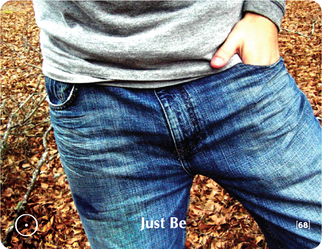

# JUST BE

## Zen Story
A happy-go-lucky centipede lived a quiet and peaceful life out in the jungle, without a care in the world -- until, that is, a philosophical frog approached it one day and asked it a strange question:

"What is the order you move your legs in when you walk?" the frog asked. "How does a centipede decide which leg to move first and which leg to move next? And with one hundred of them to choose from to boot!"

Coping with 100 legs seemed to the frog to be a big problem, and it was most eager to solve the puzzle. The centipede, for its part, was somewhat surprised and unsure:

"This is how I have walked all my life, and I have never asked myself that question. Let me think about it," it said, standing still for a few moments and quietly thinking about the answer.

"Hmmm," it thought to itself, "the frog is quite right: Which leg do I move first?"

The centipede then tried to take a step forward; but ...oops! Its legs got tangled up and it fell over.

It then turned to the frog and said: "Pleeeeease! My dear frog, don't ever ask that same question of another centipede; I have walked without any problems my entire life, and now ... I cannot move!"

## Key Quotes

> Perhaps if I were not afraid to be myself, I would be a natural joker. A humorous retort may be flickering in my mind, but the fear of what people might think, stops me from saying what comes to my mind.
> 
> **Hugh Prather, Notes to Myself**

> Enjoy the journey, enjoy every moment, and quit worrying about winning or losing.
> 
> **Matt Biondi**

> Don't underestimate the value of Doing Nothing, of just going along, listening to all the things you can't hear, and not bothering.
> 
> **A. A. Milne, Winnie the Pooh**

> To simply Be is very exhausting because the price you pay for simply existing is all you have. You have to lose everything in order to simply Be.
> 
> **Osho**

## Reflection Questions

- **What does to simply Be, mean?**
- **How does one do nothing? Is it difficult?**
- **Do I ever permit myself to simply Be and do nothing?**
- **Do I allow myself to be me?**

## Common Responses

### Resistance to Being
- I feel like letting go. What am I going to do? I go with the flow. I'm exhausted.
- What will be? I just want to. It's too complicated. You have to work hard at it. I have to do something.
- I'm worried. I feel like doing nothing. I don't know what to do with myself. What will people say?

## Training Applications

This building block can be used to:
- Help participants embrace their authentic selves
- Address overthinking and analysis paralysis
- Build comfort with stillness and presence
- Foster self-acceptance and natural expression
