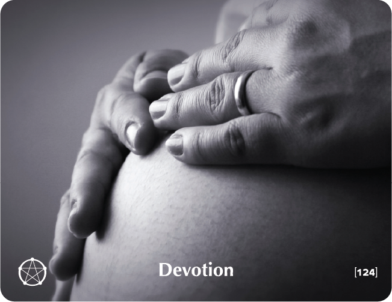

# DEVOTION

## Warrior Story
A long while ago, a great warrior faced a situation which made it necessary for him to make a decision which insured his success on the battlefield. He was about to send his armies against a powerful enemy whose men outnumbered his own.

He loaded his soldiers into boats, sailed to the enemy's country, unloaded soldiers and equipment, and then gave the order to burn the ships that had carried them.

Addressing his men before the first battle, he said, 'You see the boats going up in smoke. That means that we cannot leave these shores alive unless we win! We now have no choice -- we win or we perish!'

They won.

Every person who wins in any undertaking must be willing to burn his ships and cut all sources of retreat.

## Key Quotes

> Devotion is the place at which we are willing to remain true to ourselves and our choices, at which we are ready to take the plunge and pay any price required.
> 
> **Yaron Golan**

> There are only two options regarding commitment. You're either IN or you're OUT. There's no such thing as life in-between.
> 
> **Pat Riley**

> When you believe in a thing, believe in it all the way, implicitly and unquestionably.
> 
> **Walt Disney**

> Do not allow yourselves to be disheartened by any failure as long as you have done your best.
> 
> **Mother Teresa**

## Reflection Questions

- **What is the difference between commitment and devotion?**
- **Just how truly committed to myself, my relationship, my parenthood, my work, my life am I?**
- **What are the limitations of commitment?**
- **Am I willing to pay the price of my devotion?**

## Common Responses

### Full Devotion
- I will take them down if it is the last thing I do. There is no way I am giving in. I am not sure it is worth my while.
- I have chosen to be devoted and it's a weight off my mind. I am too calculated. And what about me? I am ready to take the plunge. You can lose control.
- Que sera, sera. Such excitement. It's every day anew. When I dedicate myself to something, I forget about me.

## Training Applications

This building block can be used to:
- Help participants understand the difference between commitment and devotion
- Address half-hearted engagement and lack of follow-through
- Build dedication and persistence in pursuing goals
- Foster authentic commitment to values and relationships
