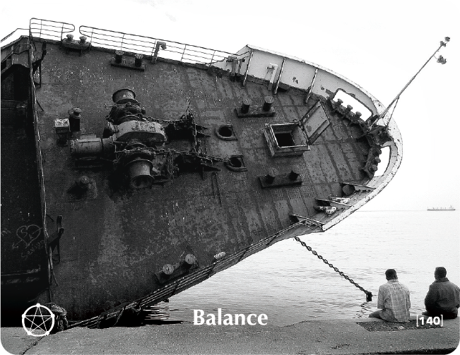

# BALANCE - Building Block Overview

## Overview
The Balance building block helps participants recognize patterns of imbalance in their lives, addressing extreme behaviors while building awareness of personal needs and boundaries for holistic well-being.

## Components

### 📖 [Stories & Tales](stories-tales.md)
- Hassidic story about the rabbi's different advice to different people
- Narrative examples of balance and the need for course correction

### 💬 [Key Quotes](key-quotes.md)
- Inspirational quotes about balance and harmony
- Wisdom from various thought leaders

### 🤔 [Reflection Questions](reflection-questions.md)
- Deep questions for personal exploration
- Self-assessment prompts about balance and well-being

### 💭 [Common Responses](common-responses.md)
- Imbalance indicators vs. balance embrace responses
- Examples of different balance mindsets

### 🎯 [Training Applications](training-applications.md)
- Specific ways to use this content in training
- Implementation strategies

## Cross-References

### Related Building Blocks
- **[Pause](../pause/README.md)** - Rest and renewal
- **[Just Be](../just-be/README.md)** - Authentic being
- **[Intimacy](../intimacy/README.md)** - Connection and boundaries
- **[Point of View](../point-of-view/README.md)** - Integrating different perspectives

### Key Concepts
- Holistic well-being
- Personal boundaries
- Sustainable practices
- Course correction

## Quick Start
1. Begin with the [Hassidic Story](stories-tales.md) to engage participants
2. Use [Reflection Questions](reflection-questions.md) for personal exploration
3. Address resistance with [Common Responses](common-responses.md)
4. Apply insights through [Training Applications](training-applications.md)
