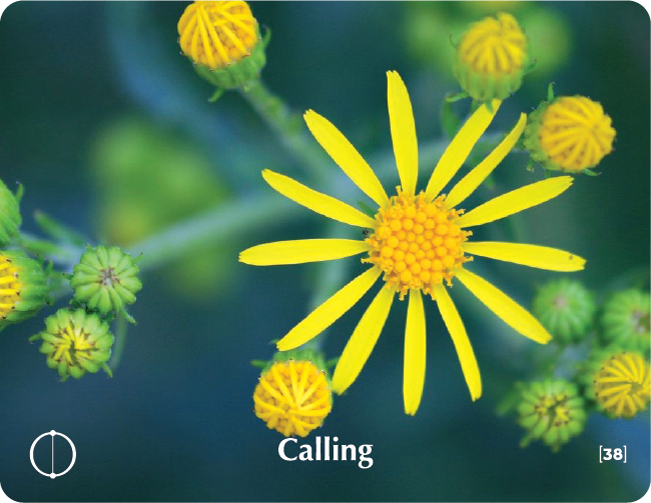

# CALLING - Building Block Overview

## Overview
The Calling building block helps participants explore their sense of purpose and calling, addressing career and life direction questions while building awareness of personal gifts and talents.

## Components

### 📖 [Stories & Tales](stories-tales.md)
- Persian folk tale about the magician and his talents
- Narrative examples of purpose and calling

### 💬 [Key Quotes](key-quotes.md)
- Inspirational quotes about purpose and destiny
- Wisdom from various thought leaders

### 🤔 [Reflection Questions](reflection-questions.md)
- Deep questions for personal exploration
- Self-assessment prompts about purpose and calling

### 💭 [Common Responses](common-responses.md)
- Searching for purpose vs. living with purpose responses
- Examples of different calling mindsets

### 🎯 [Training Applications](training-applications.md)
- Specific ways to use this content in training
- Implementation strategies

## Cross-References

### Related Building Blocks
- **[Choice](../choice/README.md)** - Choosing to follow your calling
- **[Devotion](../devotion/README.md)** - Deep commitment to purpose
- **[Success](../success/README.md)** - Achieving purpose-driven goals
- **[Leadership](../leadership/README.md)** - Leading from your calling

### Key Concepts
- Purpose and meaning
- Personal gifts and talents
- Life direction
- Mission and destiny

## Quick Start
1. Begin with the [Persian Folk Tale](stories-tales.md) to engage participants
2. Use [Reflection Questions](reflection-questions.md) for personal exploration
3. Address resistance with [Common Responses](common-responses.md)
4. Apply insights through [Training Applications](training-applications.md)
