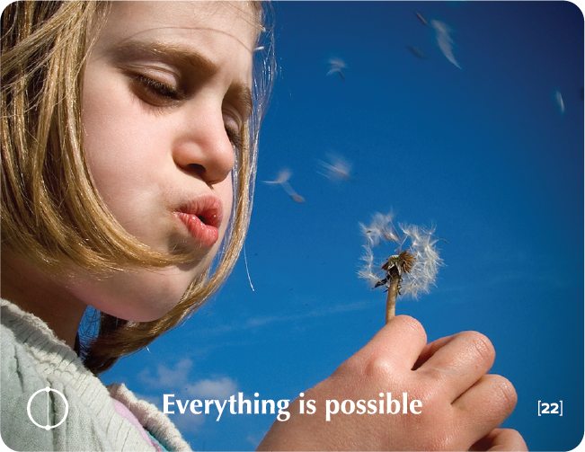

# EVERYTHING IS POSSIBLE - Building Block Overview

## Overview
The Everything is Possible building block challenges limiting beliefs and expands possibilities, encouraging participants to dream big and think creatively.

## Components

### 📖 [Stories & Tales](stories-tales.md)
- Walt Disney story about overcoming rejection and building an empire
- Narrative examples of turning impossible dreams into reality

### 💬 [Key Quotes](key-quotes.md)
- Inspirational quotes about possibility and dreaming
- Wisdom from various thought leaders

### 🤔 [Reflection Questions](reflection-questions.md)
- Deep questions for personal exploration
- Visioning exercises for possibility thinking

### 💭 [Common Responses](common-responses.md)
- Limiting beliefs vs. possibility thinking
- Examples of different mindsets

### 🎯 [Training Applications](training-applications.md)
- Specific ways to use this content in training
- Implementation strategies

## Cross-References

### Related Building Blocks
- **[Solutions](../solutions/README.md)** - Creative problem-solving approaches
- **[Learning](../learning/README.md)** - Openness to new possibilities
- **[Choice](../choice/README.md)** - Choosing to pursue possibilities
- **[Success](../success/README.md)** - Achieving ambitious goals

### Key Concepts
- Limiting beliefs
- Creative thinking
- Visioning
- Breakthrough innovation

## Quick Start
1. Begin with the [Walt Disney Story](stories-tales.md) to inspire participants
2. Use [Reflection Questions](reflection-questions.md) for personal exploration
3. Address resistance with [Common Responses](common-responses.md)
4. Apply insights through [Training Applications](training-applications.md)
