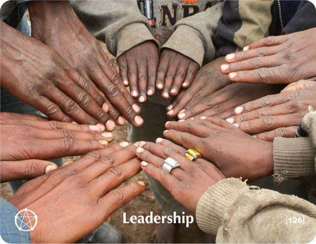

# LEADERSHIP - Building Block Overview

## Overview
The Leadership building block helps participants recognize their leadership potential and style, addressing leadership fears while building confidence in taking initiative and responsibility.

## Components

### 📖 [Stories & Tales](stories-tales.md)
- Sufi tale about the lion cub discovering its true nature
- Narrative examples of leadership development and self-discovery

### 💬 [Key Quotes](key-quotes.md)
- Inspirational quotes about leadership and teaching
- Wisdom from various thought leaders

### 🤔 [Reflection Questions](reflection-questions.md)
- Deep questions for personal exploration
- Self-assessment prompts about leadership potential

### 💭 [Common Responses](common-responses.md)
- Leadership resistance vs. leadership embrace responses
- Examples of different leadership mindsets

### 🎯 [Training Applications](training-applications.md)
- Specific ways to use this content in training
- Implementation strategies

## Cross-References

### Related Building Blocks
- **[Calling](../calling/README.md)** - Leading from your calling
- **[Devotion](../devotion/README.md)** - Leading with devotion
- **[Point of View](../point-of-view/README.md)** - Leading with perspective
- **[Intimacy](../intimacy/README.md)** - Leading with connection

### Key Concepts
- Leadership potential
- Self-discovery
- Initiative and responsibility
- Authentic leadership

## Quick Start
1. Begin with the [Sufi Tale](stories-tales.md) to engage participants
2. Use [Reflection Questions](reflection-questions.md) for personal exploration
3. Address resistance with [Common Responses](common-responses.md)
4. Apply insights through [Training Applications](training-applications.md)
