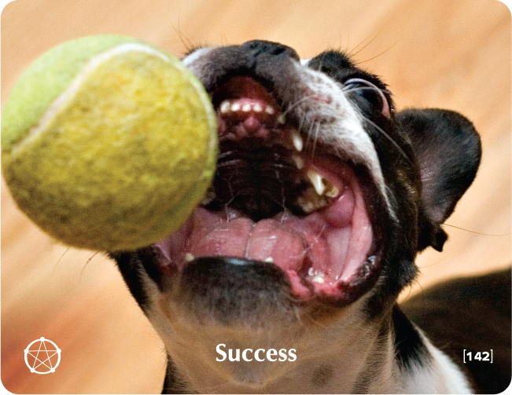

# SUCCESS - Building Block Overview

## Overview
The Success building block helps participants define success on their own terms, addressing fear of failure while building persistence and resilience in pursuing authentic achievement.

## Components

### 📖 [Stories & Tales](stories-tales.md)
- Land of Fools story about different approaches to success
- Narrative examples of authentic vs. external success

### 💬 [Key Quotes](key-quotes.md)
- Inspirational quotes about success and achievement
- Wisdom from various thought leaders

### 🤔 [Reflection Questions](reflection-questions.md)
- Deep questions for personal exploration
- Self-assessment prompts about success and achievement

### 💭 [Common Responses](common-responses.md)
- Success challenges vs. success embrace responses
- Examples of different success mindsets

### 🎯 [Training Applications](training-applications.md)
- Specific ways to use this content in training
- Implementation strategies

## Cross-References

### Related Building Blocks
- **[Calling](../calling/README.md)** - Success through purpose
- **[Devotion](../devotion/README.md)** - Success through commitment
- **[Choice](../choice/README.md)** - Choosing success
- **[Everything is Possible](../everything-is-possible/README.md)** - Success through possibility thinking

### Key Concepts
- Authentic achievement
- Personal fulfillment
- Persistence and resilience
- Self-defined success

## Quick Start
1. Begin with the [Land of Fools Story](stories-tales.md) to engage participants
2. Use [Reflection Questions](reflection-questions.md) for personal exploration
3. Address resistance with [Common Responses](common-responses.md)
4. Apply insights through [Training Applications](training-applications.md)
