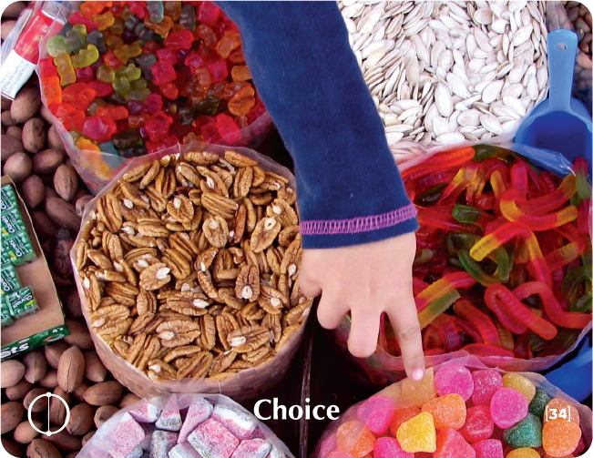

# CHOICE

## African Folk Tale
There was once a truly beautiful bird -- strong, free and very brave. Nothing at all frightened it. It would fly wherever it chose to and was very proud of its very colorful and vibrant plumage.

One day, the bird decided to settle down and build a nest for itself. And so, one by one, it began to pluck out its feathers and to use them to build a beautiful nest, one that was comfortable and gave the bird a true sense of security.

And the bird was happy!

But it could no longer fly.

## Key Quotes

> We choose our sorrows and joys long before we experience them.
> 
> **Khalil Gibran**

> When you have to make a choice and don't make it, that in itself is a choice.
> 
> **William James**

> If you limit your choices only to what seems possible or reasonable, you disconnect yourself from what you truly want, and all that is left is a compromise.
> 
> **Robert Fritz**

> We hardly ever realize that we can cut anything out of our lives, anytime, in the blink of an eye.
> 
> **Carlos Castaneda**

## Reflection Questions

- **Just how much is free choice and how much is pre-determined?**
- **What price do I pay for avoiding making a choice?**
- **What kind of relationships do I choose to be in?**
- **Who do I choose to be? What do I choose to express?**

## Common Responses

### Avoiding Choice
- I have no choice. I have to. It's not up to me. I made my choice; now I am relieved. Everything is clear now.
- I cannot change. Staying on both sides of the fence.
- I don't know what is right for me. I prefer to wait for something to happen. What if I go wrong? Tomorrow. Another time. It'll work out...

### Embracing Choice
- I have chosen to be devoted and it's a weight off my mind. I am too calculated. And what about me? I am ready to take the plunge. You can lose control.
- Que sera, sera. Such excitement. It's every day anew. When I dedicate myself to something, I forget about me.

## Training Applications

This building block can be used to:
- Help participants recognize their power of choice in various situations
- Address choice paralysis and decision-making challenges
- Build confidence in making difficult decisions
- Foster personal responsibility and empowerment
