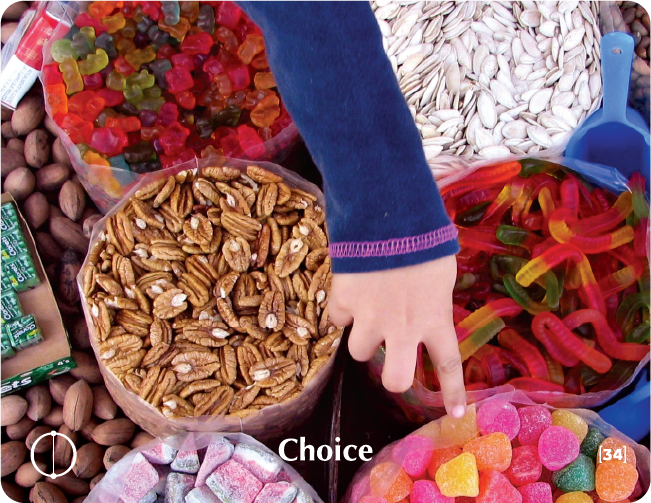

# CHOICE - Building Block Overview

## Overview
The Choice building block explores personal power and responsibility, helping participants recognize their power of choice in various situations and build confidence in decision-making.

## Components

### 📖 [Stories & Tales](stories-tales.md)
- African folk tale about the beautiful bird and its choices
- Narrative examples of choice and consequence

### 💬 [Key Quotes](key-quotes.md)
- Inspirational quotes about choice and personal responsibility
- Wisdom from various thought leaders

### 🤔 [Reflection Questions](reflection-questions.md)
- Deep questions for personal exploration
- Self-assessment prompts about choice and decision-making

### 💭 [Common Responses](common-responses.md)
- Avoiding choice vs. embracing choice responses
- Examples of different choice mindsets

### 🎯 [Training Applications](training-applications.md)
- Specific ways to use this content in training
- Implementation strategies

## Cross-References

### Related Building Blocks
- **[Solutions](../solutions/README.md)** - Choosing how to respond to problems
- **[Should Be](../should-be/README.md)** - Choosing authentic over external expectations
- **[Devotion](../devotion/README.md)** - Choosing deep commitment
- **[Success](../success/README.md)** - Choosing to pursue goals

### Key Concepts
- Personal responsibility
- Decision-making
- Choice paralysis
- Empowerment

## Quick Start
1. Begin with the [African Folk Tale](stories-tales.md) to engage participants
2. Use [Reflection Questions](reflection-questions.md) for personal exploration
3. Address resistance with [Common Responses](common-responses.md)
4. Apply insights through [Training Applications](training-applications.md)
