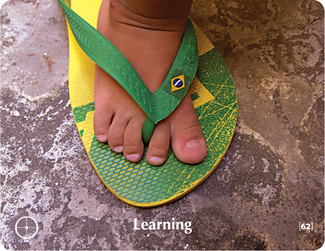

# LEARNING - Building Block Overview

## Overview
The Learning building block explores openness to new learning, challenging assumptions, and maintaining a beginner's mind.

## Components

### 📖 [Stories & Tales](stories-tales.md)
- Zen story about the ocean frog and well frog
- Narrative examples of learning resistance and openness

### 💬 [Key Quotes](key-quotes.md)
- Inspirational quotes about learning and growth
- Wisdom from various thought leaders

### 🤔 [Reflection Questions](reflection-questions.md)
- Deep questions for personal exploration
- Self-assessment prompts about learning

### 💭 [Common Responses](common-responses.md)
- Closed vs. open learning responses
- Examples of different learning mindsets

### 🎯 [Training Applications](training-applications.md)
- Specific ways to use this content in training
- Implementation strategies

## Cross-References

### Related Building Blocks
- **[Solutions](../solutions/README.md)** - Openness to new approaches
- **[Everything is Possible](../everything-is-possible/README.md)** - Expanding what we believe is possible
- **[Point of View](../point-of-view/README.md)** - Understanding different perspectives
- **[Pause](../pause/README.md)** - Taking time to reflect and learn

### Key Concepts
- Beginner's mind
- Learning agility
- Challenging assumptions
- Growth mindset

## Quick Start
1. Begin with the [Zen Story](stories-tales.md) to engage participants
2. Use [Reflection Questions](reflection-questions.md) for personal exploration
3. Address resistance with [Common Responses](common-responses.md)
4. Apply insights through [Training Applications](training-applications.md)
