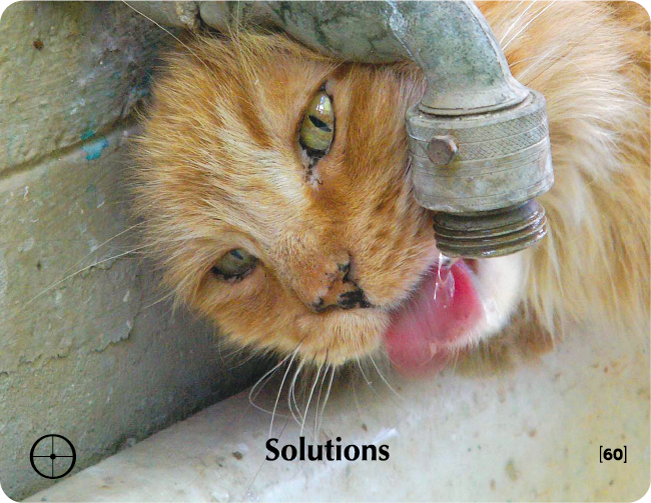

# SOLUTIONS - Building Block Overview

## Overview
The Solutions building block focuses on shifting from problem-focused to solution-focused thinking, encouraging creative problem-solving and resilience.

## Components

### 📖 [Stories & Tales](stories-tales.md)
- Folk tale about the farmer and his two sons
- Narrative examples of creative problem-solving

### 💬 [Key Quotes](key-quotes.md)
- Inspirational quotes about problem-solving approaches
- Wisdom from various thought leaders

### 🤔 [Reflection Questions](reflection-questions.md)
- Deep questions for personal exploration
- Self-assessment prompts

### 💭 [Common Responses](common-responses.md)
- Problem-focused vs. solution-focused responses
- Examples of different mindsets

### 🎯 [Training Applications](training-applications.md)
- Specific ways to use this content in training
- Implementation strategies

## Cross-References

### Related Building Blocks
- **[Learning](../learning/README.md)** - Openness to new approaches
- **[Everything is Possible](../everything-is-possible/README.md)** - Expanding possibilities
- **[Choice](../choice/README.md)** - Taking responsibility for solutions
- **[Pause](../pause/README.md)** - Taking time to reflect before acting

### Key Concepts
- Problem-solving mindset
- Creative thinking
- Resilience building
- Growth mindset

## Quick Start
1. Begin with the [Folk Tale](stories-tales.md) to engage participants
2. Use [Reflection Questions](reflection-questions.md) for personal exploration
3. Address resistance with [Common Responses](common-responses.md)
4. Apply insights through [Training Applications](training-applications.md)
