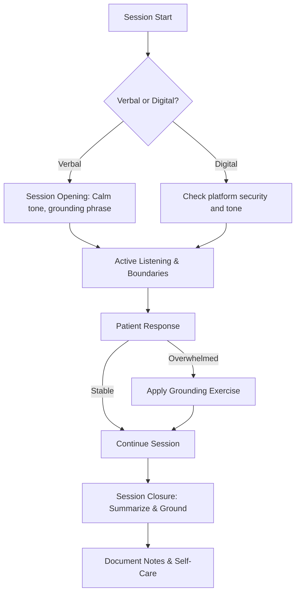

# Protocol: Communication Guidelines for Coaching Therapy Relieving PTSD Symptoms

This protocol outlines structured **verbal** and **digital** communication practices to ensure safety, trust, and therapeutic effectiveness for PTSD patients.

---

## Section 1: Verbal Communication Protocol

### 1.1 Session Opening
- [ ] Begin with a calm, steady tone of voice.
- [ ] Offer a brief grounding phrase (e.g., “You are safe here, in this moment”).
- [ ] Confirm patient’s comfort and willingness to proceed.

### 1.2 Language Use
- [ ] Speak in short, simple sentences.
- [ ] Avoid jargon, metaphors, or emotionally loaded words.
- [ ] Maintain non-judgmental, validating phrasing.

### 1.3 Active Listening
- [ ] Use reflective statements (“It sounds like you felt…”).
- [ ] Apply gentle prompts (“Would you like to share more?”).
- [ ] Allow pauses and silence without pressure.

### 1.4 Boundaries
- [ ] Do not press for traumatic details unless patient initiates.
- [ ] Avoid graphic or triggering language.
- [ ] Shift to grounding exercises if signs of overwhelm appear.

### 1.5 Session Closure
- [ ] Summarize the main themes discussed.
- [ ] Reinforce agency and choice (“You controlled today’s direction”).
- [ ] End with a grounding or calming technique (breathing, visualization).

---

## Section 2: Digital Communication Protocol

### 2.1 Security
- [ ] Use encrypted, HIPAA/GDPR-compliant platforms for sessions.
- [ ] Protect personal data; use initials or pseudonyms when possible.
- [ ] Keep professional and personal accounts/devices separate.

### 2.2 Tone in Digital Messages
- [ ] Write in calm, validating style (avoid all caps, exclamation marks).
- [ ] Keep messages concise and supportive.
- [ ] Structure text into short paragraphs or bullet points.

### 2.3 Responsiveness
- [ ] Define response times clearly (e.g., within 24–48 hours).
- [ ] Acknowledge receipt of patient’s message if full reply will be delayed.
- [ ] Provide emergency contacts and clarify that digital channels are not for crises.

### 2.4 Accessibility
- [ ] Use clear fonts, adequate spacing, and high-contrast colors.
- [ ] Offer transcripts or written summaries of sessions if requested.
- [ ] Enable captions during video sessions.

---

## Section 3: Combined Practices

- [ ] Start every session (verbal or digital) with a safety check-in.
- [ ] End every session with grounding or calming closure.
- [ ] Align tone and style across both verbal and digital communications.
- [ ] Regularly revisit patient preferences for communication style and adjust.

---

## Section 4: Therapist Self-Care

- [ ] Monitor own tone and style to avoid secondary trauma.
- [ ] Engage in supervision or peer review for communication practices.
- [ ] Maintain digital hygiene: secure passwords, encrypted storage, professional accounts only.

---

## Section 5: Approved Example Phrases

### Verbal
- “It makes sense that you feel this way.”
- “You are safe here; we can pause if you’d like.”

### Digital
- “Thank you for sharing this with me. We can explore it further in our session.”
- “If you feel unsafe at any time, please contact [local crisis line / emergency number].”

---

## Section 6: Flowchart (Mermaid)

---

**Note:** This protocol supports safe coaching practice but does not replace clinical treatment standards or emergency procedures.
